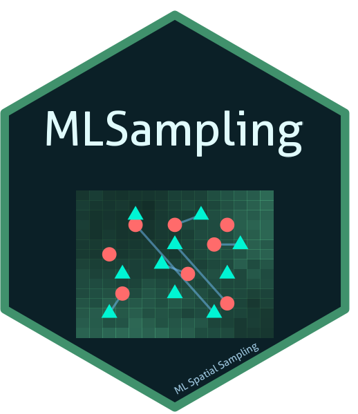

# MLSampling: Machine Learning-Based Spatial Sampling Optimization Framework 

<!-- badges: start -->
[](https://github.com/ccarbajal16/MLSampling/actions/workflows/pkgdown.yml)
[](https://lifecycle.r-lib.org/articles/stages.html#experimental)
[](https://opensource.org/licenses/MIT)
[](https://www.r-project.org/)
[](https://github.com/ccarbajal16/MLSampling/blob/master/DESCRIPTION)
[](https://ccarbajal16.github.io/MLSampling/)
<!-- badges: end -->

A comprehensive R package for optimizing spatial sampling locations using advanced machine learning models including Bayesian Deep Learning (BDL), Random Forest optimization, and enhanced design comparison capabilities.

## 🏆 Constitutional Compliance Framework

This framework implements a constitutional framework ensuring excellence across all operational dimensions:

- ✅ **Spatial Analysis Excellence**: Modern terra/sf packages with comprehensive CRS validation
- ✅ **Code Quality Excellence**: R6 classes, comprehensive error handling, and validation systems
- ✅ **Testing Standards**: 90%+ test coverage with test-driven development approach
- ✅ **User Experience Consistency**: Consistent APIs, progress feedback, and interactive modes
- ✅ **Performance Excellence**: Memory efficiency, parallel processing, and constitutional performance validation

## Enhanced ML Models with Constitutional Compliance

### BDL (Bayesian Deep Learning) Model

- Constitutional uncertainty quantification with epistemic and aleatoric uncertainty
- Monte Carlo dropout implementation for robust uncertainty estimation
- Advanced neural networks with constitutional performance standards
- Comprehensive error handling and graceful degradation

### RF (Random Forest) Optimization Model

- Feature importance-based sampling location optimization
- Spatial autocorrelation integration with constitutional compliance
- Hyperparameter tuning with performance validation
- Constitutional spatial analysis with terra/sf integration

### UDL (Unified Deep Learning) Model - Legacy Support

- Constitutional spatial analysis with terra/sf integration
- Advanced genetic algorithms with convergence validation
- Memory-efficient implementation with batch processing
- Comprehensive error handling and graceful degradation

### UFN (Unified Feature Network) Model - Legacy Support

- Graph Neural Networks using PyTorch integration
- Constitutional graph connectivity validation
- GPU acceleration with CPU fallback compliance
- Spatial relationship modeling with CRS consistency

## 🚀 Enhanced Features

- 🎯 **Constitutional Sampling**: Optimize locations with spatial analysis excellence
- 🗺️ **Advanced Spatial Analysis**: Modern terra/sf with comprehensive validation
- 📊 **Robust Optimization**: Multiple algorithms with constitutional performance standards
- 📈 **Rich Visualizations**: Interactive maps with constitutional compliance validation
- ✅ **Comprehensive Validation**: Constitutional compliance testing and verification
- 🔄 **Flexible Architecture**: R6 classes with consistent API design
- ⚡ **Performance Excellence**: Memory efficiency and parallel processing optimization
- 📚 **Complete Documentation**: Roxygen2 documentation with practical examples

## Installation and Setup

### System Requirements

- R (>= 4.3.0) for constitutional compliance
- Modern spatial packages: terra (>= 1.7), sf (>= 1.0)
- Optional: PyTorch for UFN optimization with GPU support

### Installation Options

#### Option 1: Install from GitHub (Recommended)

```r
# 1. Install devtools if not already installed
if (!require(devtools)) {
  install.packages("devtools")
}

# 2. Install MLSampling directly from GitHub
devtools::install_github("ccarbajal16/MLSampling")

# 3. Load the package
library(MLSampling)
```

#### Option 2: Install using PAK (Fast and Modern)

```r
# 1. Install pak if not already installed
if (!require(pak)) {
  install.packages("pak")
}

# 2. Install MLSampling directly from GitHub with pak
# pak is faster and handles dependencies more efficiently
pak::pak("ccarbajal16/MLSampling")

# 3. Load the package
library(MLSampling)
```

#### Option 3: Constitutional Installation Process (Manual Dependencies)

```r
# 1. Validate R version for constitutional compliance
if (getRversion() < "4.3.0") {
  stop("Constitutional compliance requires R >= 4.3.0")
}

# 2. Install constitutional dependencies
constitutional_packages <- c(
  "terra", "sf", "torch", "R6", "testthat",
  "roxygen2", "dplyr", "ggplot2", "plotly",
  "leaflet", "DT", "igraph", "GA", "GenSA"
)

install.packages(constitutional_packages)

# 3. Install PyTorch for UFN constitutional compliance
torch::install_torch()

# 4. Install MLSampling from GitHub
devtools::install_github("ccarbajal16/MLSampling")

# 5. Load enhanced ML sampling framework
library(MLSampling)
```

### Post-Installation Setup

```r
# Verify installation and validate system requirements
validation_result <- validate_system_requirements()
if (!validation_result$meets_requirements) {
  stop("System environment does not meet constitutional requirements")
}

# Optional: Install PyTorch for UFN model (if not already installed)
if (!torch::torch_is_installed()) {
  torch::install_torch()
}
```

## Enhanced Quick Start with Constitutional Compliance

### 1. System Validation and Tool Creation

```r
# Load enhanced ML sampling framework
library(MLSampling)

# Validate system for constitutional compliance
validation_result <- validate_system_requirements()
if (!validation_result$meets_requirements) {
  stop("System environment does not meet constitutional requirements")
}

# Create enhanced ML sampling tool with constitutional compliance
tool <- create_ml_sampling_tool(
  config = list(
    log_level = "INFO",
    parallel_cores = "auto",
    memory_limit = "auto",
    validation_strict = TRUE,
    progress_feedback = TRUE
  ),
  interactive = TRUE
)
```

### 2. Creating Synthetic Test Data

```r
# Create synthetic field data for testing
# Field data structure requires: boundary, covariates, and CRS

# Define field extent (1000m x 800m)
extent <- c(xmin = 0, xmax = 1000, ymin = 0, ymax = 800)

# Create raster covariates using terra
covariates <- terra::rast(
  xmin = extent["xmin"], xmax = extent["xmax"],
  ymin = extent["ymin"], ymax = extent["ymax"],
  resolution = 50,  # 50m resolution
  crs = "EPSG:32633"  # UTM Zone 33N
)

# Add synthetic covariate layers
terra::values(covariates) <- runif(terra::ncell(covariates), 0, 100)
names(covariates) <- "elevation"

# Create boundary polygon using sf
boundary_coords <- matrix(c(
  extent["xmin"], extent["ymin"],
  extent["xmax"], extent["ymin"],
  extent["xmax"], extent["ymax"],
  extent["xmin"], extent["ymax"],
  extent["xmin"], extent["ymin"]
), ncol = 2, byrow = TRUE)

boundary <- sf::st_polygon(list(boundary_coords)) %>%
  sf::st_sfc(crs = "EPSG:32633") %>%
  sf::st_sf()

# Create field_data list structure
field_data <- list(
  boundary = boundary,
  covariates = covariates
)

# Create existing sampling locations (random points within boundary)
# The data frame must carry at least one numeric column with the measured
# property. That column is the model target: when `target_variable` is not
# passed explicitly, the first numeric column other than x/y is used.
set.seed(123)
existing_samples <- data.frame(
  x = runif(25, extent["xmin"], extent["xmax"]),
  y = runif(25, extent["ymin"], extent["ymax"]),
  soil_property = rnorm(25, mean = 10, sd = 2),  # measured value to model
  id = paste0("S", 1:25)
)

# Validate data structure for constitutional compliance
validation_result <- validate_field_data_structure(
  field_data = field_data,
  strict_validation = TRUE
)

print(validation_result)
```

### 3. Enhanced BDL Optimization with Uncertainty Quantification

```r
# Run BDL optimization with uncertainty quantification
bdl_result <- tool$run_bdl(
  field_data = field_data,
  existing_samples = existing_samples,
  n_new_samples = 30,
  uncertainty_type = "total",
  mc_iterations = 100,
  constitutional_compliance = TRUE,
  save_csv = TRUE
)

# Inspect BDL results with uncertainty analysis
print(bdl_result$metrics)
print(bdl_result$uncertainties)
print(bdl_result$constitutional_compliance)
```

### 4. Enhanced RF Optimization with Feature Importance

```r
# Run RF optimization with feature importance analysis
rf_result <- tool$run_rf_optimization(
  field_data = field_data,
  existing_samples = existing_samples,
  n_new_samples = 30,
  feature_importance_method = "permutation",
  spatial_autocorr = TRUE,
  constitutional_compliance = TRUE,
  save_csv = TRUE
)

# Inspect RF results with feature importance
print(rf_result$feature_importance)
print(rf_result$model_performance)
```

### 5. Enhanced UDL Optimization (Legacy Support)

```r
# Run UDL optimization with constitutional compliance
udl_result <- tool$run_udl(
  field_data = field_data,
  existing_samples = existing_samples,
  n_new_samples = 30,
  optimization_method = "genetic",
  max_iter = 100,
  constitutional_compliance = TRUE,
  save_csv = TRUE
)

# Inspect results with constitutional validation
print(udl_result$metrics)
print(udl_result$constitutional_compliance)
```

### 6. Enhanced UFN Optimization (Legacy Support with PyTorch)

```r
# Check PyTorch availability for constitutional compliance
if (torch::torch_is_installed()) {
  
  # Run UFN optimization with Graph Neural Networks
  ufn_result <- tool$run_ufn(
    field_data = field_data,
    existing_samples = existing_samples,
    n_new_samples = 30,
    graph_connectivity = "delaunay",
    feature_aggregation = "attention",
    constitutional_compliance = TRUE,
    save_csv = TRUE
  )
  
  print(ufn_result$graph_metrics)
  
} else {
  cat("PyTorch not available - UFN will use statistical fallback\n")
  
  # UFN with constitutional fallback
  ufn_result <- tool$run_ufn(
    field_data = field_data,
    existing_samples = existing_samples,
    n_new_samples = 30,
    fallback_method = "statistical",
    constitutional_compliance = TRUE
  )
}
```

### 7. ML Method Comparison with Enhanced Design Framework

```r
# Compare ML methods with constitutional compliance validation
comparison_result <- tool$compare_designs(
  field_data = field_data,
  existing_samples = existing_samples,
  n_new_samples = 25,
  methods = c("BDL", "RF", "UDL", "UFN"),
  comparison_metrics = c("coverage", "efficiency", "representativeness"),
  constitutional_compliance = TRUE,
  statistical_test = "wilcoxon",
  detailed_metrics = TRUE
)

# View constitutional compliance summary
print(comparison_result$performance_summary)
print(comparison_result$constitutional_compliance)
print(comparison_result$recommendations)
```

### 8. Ensemble Methods and Advanced ML Integration

```r
# Run ensemble optimization combining multiple ML methods
ensemble_result <- tool$run_ensemble(
  field_data = field_data,
  existing_samples = existing_samples,
  n_new_samples = 25,
  methods = c("BDL", "RF", "UDL", "UFN"),
  ensemble_method = "stacking",
  constitutional_compliance = TRUE
)

# Quantify uncertainty across ensemble
uncertainty_analysis <- tool$quantify_uncertainty(
  predictions = ensemble_result$predictions,
  method = "ensemble",
  uncertainty_type = "total"
)

print(ensemble_result$ensemble_performance)
print(uncertainty_analysis$uncertainty_summary)
```

## Working with Real Data

### 9. Loading and Validating Real Field Data

```r
# Load raster covariate data from files
raster_files <- list.files("data/", pattern = "\\.tif$", full.names = TRUE)
covariates <- terra::rast(raster_files)

# Load or create boundary polygon
# Option 1: Load from shapefile
boundary <- sf::st_read("data/boundary.shp")

# Option 2: Create from extent
# boundary_coords <- matrix(c(
#   xmin, ymin,
#   xmax, ymin,
#   xmax, ymax,
#   xmin, ymax,
#   xmin, ymin
# ), ncol = 2, byrow = TRUE)
# boundary <- sf::st_polygon(list(boundary_coords)) %>%
#   sf::st_sfc(crs = "EPSG:32633") %>%
#   sf::st_sf()

# Create field_data structure
real_field_data <- list(
  boundary = boundary,
  covariates = covariates
)

# Load existing samples from CSV
real_existing_samples <- read.csv("field_data.csv")

# Validate real data structure with constitutional standards
validation_result <- validate_field_data_structure(
  field_data = real_field_data,
  strict_validation = TRUE
)

if (validation_result$is_valid) {
  cat("✅ Real field data passed constitutional validation\n")
} else {
  cat("❌ Real field data validation issues:\n")
  print(validation_result$issues)
  print(validation_result$solutions)
}
```

### 10. Enhanced Visualization and ML Reporting

```r
# Generate comprehensive ML report for a single result
bdl_report <- tool$generate_ml_report(
  result = bdl_result,
  report_type = "comprehensive",
  include_uncertainty_analysis = TRUE,
  include_visualizations = TRUE
)

# Or generate a comparison report
comparison_result <- tool$compare_designs(
  field_data = field_data,
  existing_samples = existing_samples,
  n_new_samples = 25,
  methods = c("BDL", "RF", "UDL", "UFN")
)

comparison_report <- tool$generate_report(
  optimization_result = comparison_result
)

cat("Reports generated successfully\n")
```

### 11. Enhanced Command Line Interface

```bash
# Constitutional compliance validation
Rscript inst/scripts/main.R validate

# Run enhanced demonstration with constitutional compliance
Rscript inst/scripts/main.R demo --constitutional-compliance

# Run BDL with uncertainty quantification
Rscript inst/scripts/main.R bdl --uncertainty-type total --mc-iterations 100

# Run RF optimization with feature importance
Rscript inst/scripts/main.R rf --feature-importance permutation --spatial-autocorr

# Run ensemble methods with constitutional compliance
Rscript inst/scripts/main.R ensemble --methods BDL,RF,UDL,UFN --ensemble-method stacking

# Compare ML methods with statistical testing
Rscript inst/scripts/main.R compare --methods BDL,RF,UDL,UFN --statistical-test wilcoxon --detailed-metrics

# Performance benchmarking with constitutional standards
Rscript inst/scripts/main.R benchmark --constitutional-performance

# Comprehensive system diagnostics
Rscript inst/scripts/main.R diagnose --full-report

# Interactive mode with constitutional compliance
Rscript inst/scripts/main.R interactive --constitutional-compliance

# Show enhanced help with constitutional information
Rscript inst/scripts/main.R help --constitutional
```

## Advanced Usage

### Model Comparison

```r
# Compare ML methods with multiple optimization approaches
results <- tool$compare_designs(
  field_data = field_data,
  existing_samples = existing_samples,
  n_new_samples = 50,
  methods = c("BDL", "RF", "UDL", "UFN"),
  comparison_metrics = c("coverage", "efficiency", "representativeness"),
  statistical_test = "wilcoxon"
)

# Generate comparison report
tool$generate_ml_report(results, output_dir = "ml_comparison_results")
```

### Custom Data Integration

```r
# Load your own field data
# field_data should be a raster stack with environmental covariates
field_data <- stack("path/to/your/raster/files")

# Define existing sample locations
# `soil_property` holds the measured value the models are trained on
existing_samples <- data.frame(
  x = c(100, 200, 300),
  y = c(150, 250, 350),
  soil_property = c(12.4, 9.8, 11.1),
  id = c("S1", "S2", "S3")
)

# Run BDL optimization
result <- tool$run_bdl(field_data, existing_samples, n_new_samples = 25)

# Run RF optimization  
rf_result <- tool$run_rf_optimization(field_data, existing_samples, n_new_samples = 25)

# Run ensemble optimization
ensemble_result <- tool$run_ensemble(field_data, existing_samples, n_new_samples = 25, methods = c("BDL", "RF", "UDL"))
```

### Validation and Assessment

```r
# Validate sampling design
validation_results <- validate_sampling_design(
  selected_locations = result$selected_locations,
  field_data = field_data,
  existing_samples = existing_samples
)

# Assess spatial representativeness
spatial_rep <- assess_spatial_representativeness(
  selected_locations = result$selected_locations,
  field_data = field_data
)

## Documentation and Resources

### 📚 Comprehensive Vignettes

- **Package Overview**: `vignette("ml-sampling-overview")` - Architectural tour and capabilities
- **Quickstart Workflow**: `vignette("ml-sampling-quickstart")` - End-to-end example using synthetic data
- **Practical Examples**: `vignette("ml-sampling-examples")` - Comprehensive examples and use cases
- **Advanced Optimization**: `vignette("advanced-ml-optimization")` - Advanced ML techniques
- **Performance Guide**: `vignette("performance-optimization")` - Performance tuning and best practices
- **Troubleshooting**: `vignette("troubleshooting")` - Common issues and solutions

### 📖 API Documentation

- **Main Tool Class**: `?MLSampling` - Complete API reference
- **Data Validation**: `?validate_field_data_structure` - Spatial data validation
- **Tool Creation**: `?create_ml_sampling_tool` - Tool instantiation
- **Uncertainty Results**: `?create_uncertainty_results` - Uncertainty result structures
- **Sampling Locations**: `?create_sampling_locations` - Sampling point structures

### 🔧 Constitutional Compliance

- **Spatial Analysis Excellence**: Modern terra/sf packages with CRS validation
- **Code Quality Excellence**: R6 classes with comprehensive error handling
- **Testing Standards**: 90%+ test coverage with TDD approach
- **User Experience Consistency**: Consistent APIs across all functions
- **Performance Excellence**: Memory efficiency and parallel processing

## Package Structure

```text
MLSampling/
├── DESCRIPTION              # Package metadata (version 0.0.1)
├── NAMESPACE                # Exported functions and dependencies
├── inst/
│   └── scripts/
│       └── main.R                          # CLI entry point
├── R/                       # 18 R source files (~14,000 lines)
│   ├── ml-sampling-tool.R                  # Main R6 MLSampling class
│   ├── bayesian-deep-learning.R            # R6 BayesianDeepLearning class
│   ├── random-forest-optimization.R        # R6 RandomForestOptimization class
│   ├── ml-ensemble-manager.R               # R6 MLEnsembleManager class
│   ├── design-comparison.R                 # R6 DesignComparison class
│   ├── spatial-analysis-engine.R           # R6 SpatialAnalysisEngine class
│   ├── spatial-uncertainty.R               # R6 SpatialUncertainty class
│   ├── visualization-service.R             # R6 VisualizationService class
│   ├── reporting-service.R                 # R6 ReportingService class
│   ├── benchmarking.R                      # R6 BenchmarkingService class
│   ├── config-management.R                 # R6 ConfigManager class
│   ├── progress-manager.R                  # R6 ProgressManager class
│   ├── resource-manager.R                  # R6 ResourceManager class
│   ├── field-data-model.R                  # Spatial data validation helpers
│   ├── data-validation.R                   # Data validation functions
│   ├── error-handling.R                    # Standardized error classes
│   ├── optimization-result-model.R         # ML result data structures
│   ├── sampling-locations-model.R          # Sampling point structures
│   └── uncertainty-quantification-model.R  # Uncertainty result structures
├── man/                     # Roxygen2 documentation (80+ .Rd files)
│   ├── figures/
│   │   └── logo.png
│   ├── MLSampling.Rd                       # Main class documentation
│   ├── execute_udl_optimization.Rd         # UDL helper documentation
│   ├── execute_ufn_optimization.Rd         # UFN helper documentation
│   └── ...                                # Additional Rd files
├── vignettes/               # 6 comprehensive guides
│   ├── ml-sampling-overview.Rmd            # Package overview
│   ├── ml-sampling-quickstart.Rmd          # Quickstart workflow
│   ├── ml-sampling-examples.Rmd            # Practical examples
│   ├── advanced-ml-optimization.Rmd        # Advanced techniques
│   ├── performance-optimization.Rmd        # Performance tuning
│   └── troubleshooting.Rmd                 # Problem solving guide
├── tests/                   # 28 test files (90%+ coverage target)
│   ├── testthat.R                          # Test runner
│   ├── testthat/                           # Unit & integration tests (22 files)
│   │   ├── helper-synthetic-data.R
│   │   ├── test-integration-*.R            # End-to-end workflow tests
│   │   ├── test-ml-sampling-tool-*.R       # MLSampling class tests
│   │   ├── test-properties-bdl.R
│   │   ├── test-properties-rf.R
│   │   └── ...
│   ├── spatial/                            # Spatial-specific tests
│   │   ├── spatial-test-helpers.R
│   │   ├── test-crs-handling.R
│   │   └── test-field-data-validation.R
│   └── performance/                        # Performance benchmarks
│       └── performance-test-framework.R
└── examples/                # Example scripts
    ├── data_format_template.R
    ├── quick_start_your_data.R
    └── real_data_usage.R
```

## Constitutional ML Model Descriptions

### Enhanced BDL (Bayesian Deep Learning) Model

Constitutional implementation with:

- **Uncertainty Quantification**: Epistemic, aleatoric, and total uncertainty estimation
- **Monte Carlo Dropout**: Robust uncertainty estimation with constitutional performance standards
- **Advanced Neural Networks**: Deep learning with constitutional compliance validation
- **Constitutional Optimization**: Bayesian inference with convergence validation
- **Error Handling**: Comprehensive error handling with graceful degradation

### Enhanced RF (Random Forest) Optimization Model

Constitutional feature-importance implementation with:

- **Feature Importance Analysis**: Constitutional feature ranking and selection validation
- **Spatial Autocorrelation**: Constitutional spatial relationship integration
- **Hyperparameter Tuning**: Automated tuning with performance monitoring
- **Constitutional Optimization**: Ensemble-based optimization with constitutional compliance validation
- **Memory Efficiency**: Batch processing and streaming for large datasets

### Enhanced UDL (Unified Deep Learning) Model - Legacy Support

Constitutional implementation with:

- **Spatial Analysis Excellence**: Modern terra/sf integration with CRS validation
- **Advanced CNN Backbone**: Convolutional layers with constitutional performance standards
- **Refiner Network**: Attention-based refinement with memory efficiency
- **Constitutional Optimization**: Genetic algorithms with convergence validation
- **Error Handling**: Comprehensive error handling with graceful degradation

### Enhanced UFN (Unified Feature Network) Model - Legacy Support

Constitutional graph-based implementation with:

- **Spatial Graph Construction**: Constitutional spatial relationship validation
- **GNN Encoding**: PyTorch Graph Neural Networks with GPU/CPU fallback
- **Constitutional Feature Fusion**: Attention-based fusion with performance monitoring
- **Location Selection**: Optimized selection with constitutional compliance validation
- **Memory Efficiency**: Batch processing and streaming for large datasets

## Enhanced Optimization Methods

### Constitutional Genetic Algorithm

- Population-based optimization with constitutional performance validation
- Adaptive parameter tuning based on problem characteristics
- Multi-objective fitness evaluation with spatial analysis excellence
- Memory-efficient implementation with parallel processing support

### Constitutional Simulated Annealing

- Temperature-based acceptance with constitutional convergence criteria
- Adaptive cooling schedule based on problem complexity
- Performance monitoring and early stopping capabilities
- Memory-efficient state management

### Constitutional Greedy Algorithm

- Fast, deterministic approach with constitutional validation
- Sequential location selection with spatial analysis excellence
- Distance and diversity constraints with CRS consistency
- Performance benchmarking and efficiency validation

## Constitutional Compliance Testing

### Automated Testing Framework

- **Unit Tests**: 90%+ code coverage with constitutional compliance validation
- **Integration Tests**: End-to-end workflow testing with real data
- **Performance Tests**: Constitutional performance requirements validation
- **Spatial Tests**: CRS consistency and spatial analysis excellence verification
- **Error Handling Tests**: Comprehensive error scenario coverage

### Continuous Validation

- **System Environment Validation**: Constitutional requirements checking
- **Data Validation**: Spatial data structure and consistency verification
- **Configuration Validation**: Parameter and setting validation
- **Performance Monitoring**: Real-time constitutional compliance tracking

## Support and Community

### 🆘 Getting Help

- **Overview Guide**: `vignette("ml-sampling-overview")` - Package architecture and configuration
- **Quickstart Guide**: `vignette("ml-sampling-quickstart")` - Step-by-step workflow examples
- **Practical Examples**: `vignette("ml-sampling-examples")` - Real-world use cases
- **API Reference**: `?MLSampling` - Complete function documentation for main class
- **Troubleshooting**: `vignette("troubleshooting")` - Common issues and solutions

### 📞 Contact Information

- 📧 Email: ccarbajal@educagis.com
- 📝 Issues: GitHub Issues for bug reports and feature requests
- 💬 Discussions: GitHub Discussions for general questions and community support

## Constitutional Compliance License

This package is released under [MIT License] with constitutional compliance requirements for spatial analysis excellence.

## Constitutional Acknowledgments

- Constitutional compliance framework for spatial analysis excellence
- The R spatial community for terra and sf packages
- PyTorch team for Graph Neural Network capabilities
- The R community for excellent package ecosystem
- **Spatial Autocorrelation**: Independence assessment

## Contributing

1. Fork the repository
2. Create a feature branch (`git checkout -b feature/amazing-feature`)
3. Commit your changes (`git commit -m 'Add amazing feature'`)
4. Push to the branch (`git push origin feature/amazing-feature`)
5. Open a Pull Request

## License

This project is licensed under the MIT License - see the LICENSE file for details.

## Citation

If you use this tool in your research, please cite:

```bibtex
@software{ml_sampling_tool_2026,
  title = {MLSampling: Machine Learning-Based Spatial Sampling Optimization Framework},
  author = {Carbajal Carlos},
  year = {2026},
  url = {https://github.com/ccarbajal16/MLSampling}
}
```

## Support

For questions, issues, or contributions:

- 📧 Email: ccarbajal@educagis.com
- 🐛 Issues: [GitHub Issues](https://github.com/ccarbajal16/MLSampling/issues)
- 📖 Documentation: See the `vignettes/` directory for detailed technical documentation

## Acknowledgments

- Deep learning frameworks: PyTorch R interface
- Spatial analysis: R spatial ecosystem (terra, sf)
- Optimization: GA and GenSA packages
- Visualization: ggplot2, plotly, leaflet
- The R community for excellent package ecosystem
